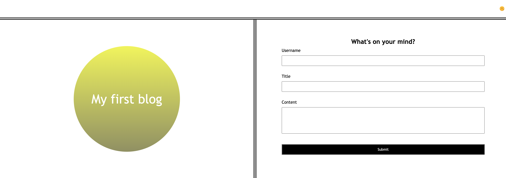
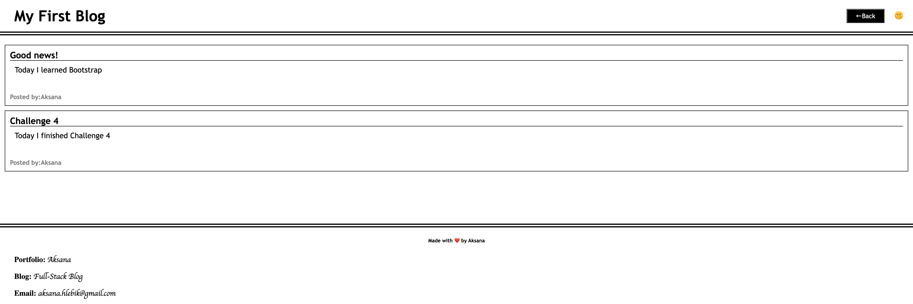

# personal-blog
This web-site is a Personal blog

## Description
This web-site was made with HTML, CSS and JavaScript.
It was created for people who wants to showcase their thoughts and experiences.

## Installation
N/A

## Usage
1. Open:  https://aksanah.github.io/personal-blog/ 
2. Fill out the fields: entrer Username, Title and Content. Next press 'Submit' button.
3. When the form submits,you will redirected to the posts page.
4. Also web-site contains light and dark mode button.

## Technologies Used
- HTML
- CSS
- JavaScript

## Mock-Up
The following images show the wed-site appearance and functionality:

